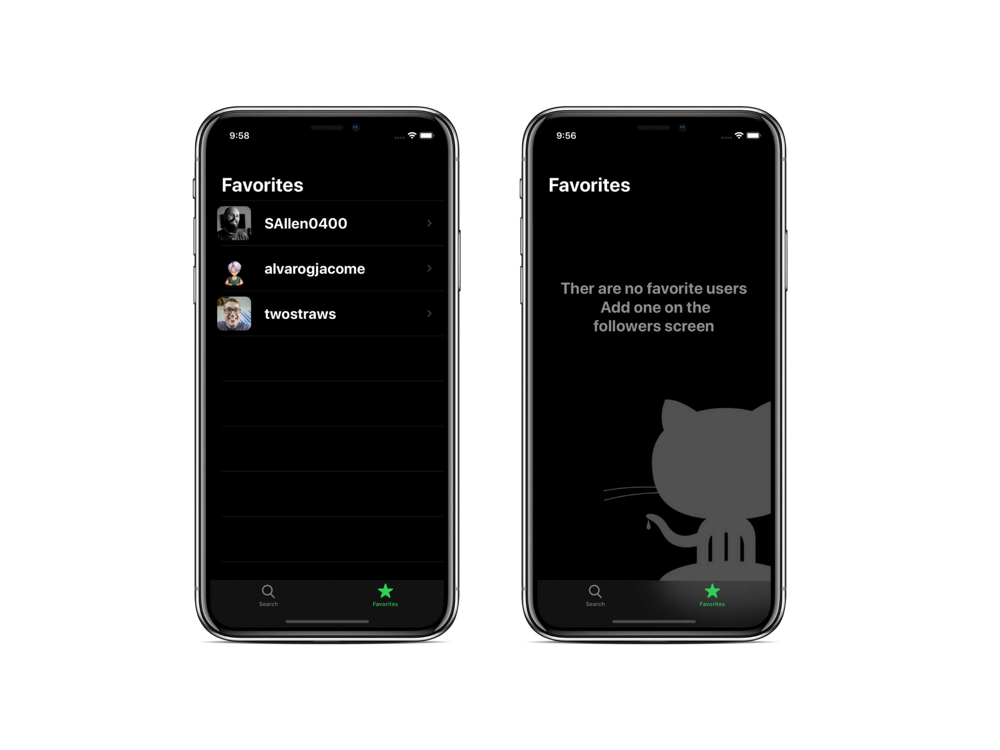

# About

The source code for this project is based on Swift course [iOS Dev Job Interview Practice - Take Home Project](https://seanallen.teachable.com/p/take-home) by [Sean Allen](https://github.com/SAllen0400)

The app does not use any third party libraries and builds UI 100% programmatically with UIKit.

# Github-Followers

